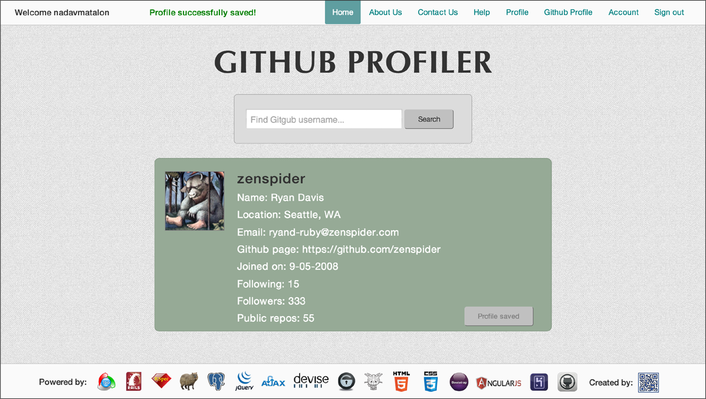
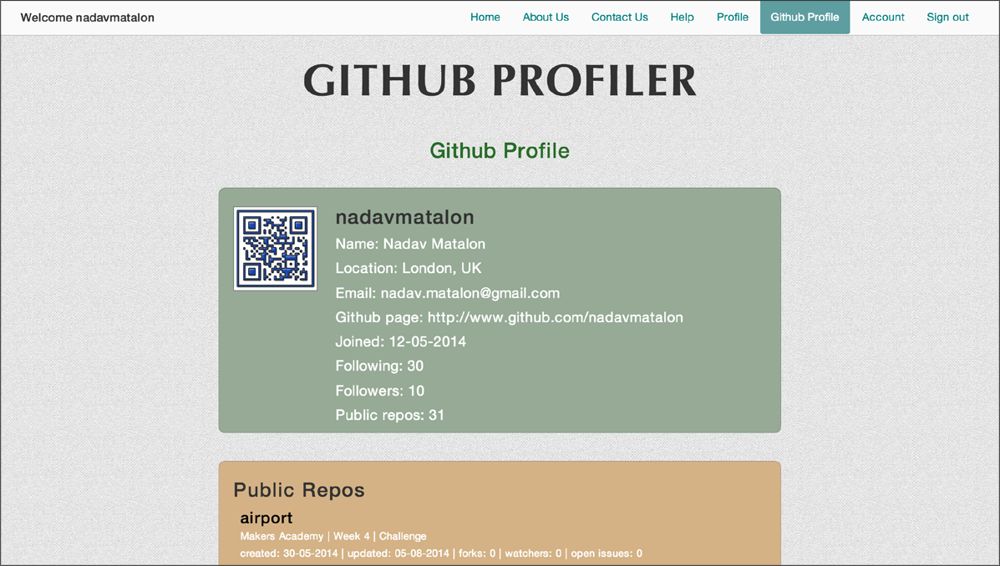

#GITHUB PROFILER 

* [Screenshots](#screenshot)
* [General Description](#general-description)
* [See it Live on Heroku](#see-it-live-on-heroku)
* [Browser Caveate](#browser-caveate)
* [Testing](#testing)
* [License](#license)

## Screenshots

<table>
	<tr>
		<td align="center" width=25% >
			<a href="https://raw.githubusercontent.com/nadavmatalon/github-profiler/master/app/assets/images/app_screenshot_1.png" >
				
				Sign up
			</a>
		</td>
		<td align="center" width=25% >
			<a href="https://raw.githubusercontent.com/nadavmatalon/github-profiler/master/app/assets/images/app_screenshot_2.png">
				
				Search Profiles
			</a>
		</td>
		<td align="center" width=25% >
			<a href="https://raw.githubusercontent.com/nadavmatalon/github-profiler/master/app/assets/images/app_screenshot_3.png">
				
				My Github Profile
			</a>
		</td>
		<td align="center" width=25% >
			<a href="https://raw.githubusercontent.com/nadavmatalon/github-profiler/master/app/assets/images/app_screenshot_4.png">
				
				Saved Profiles
			</a>
		</td>
	</tr>
</table>

##  General Description

<strong>Github Profiler</strong> is a web app for browsing and storing profiles of 
<a href="http://www.github.com">Github</a> users.
 

The app's search engine on the homepage enables all users (registered or 
unregistered) to find profiles of Github users by their username.

Each profile can then be stored in the user's account for future reference (registered
<strong>Github Profiler</strong> users only).
 

The app will automatically load the personal profiles of registered users,
including extensive information about their repos, under their profile page
(for this, users need to sign up with their Github user name).

Moreover, users can use their Github username and password to directly sign in to
<strong>Github Profiler</strong> thereby saving them the need to go through
the registration process.

##  See it Live on Heroku

A live version of the app can be found at: 
http://github-profiler.herokuapp.com

##  Browser Caveate

Please note that this app has been optimized primarily for <strong>Google Chrome</strong>, 
and to a lesser extent <strong>Apple Safari</strong>. However. it should look decent on other
browsers as well.

##  Testing

Tests were written with Rspec & Capybara.

To run the tests in terminal: $ rspec

Rspec version: 3.0.3

Capibara version: 2.3.0

##  License

Released under the <a href="http://www.opensource.org/licenses/MIT">MIT license</a>.

