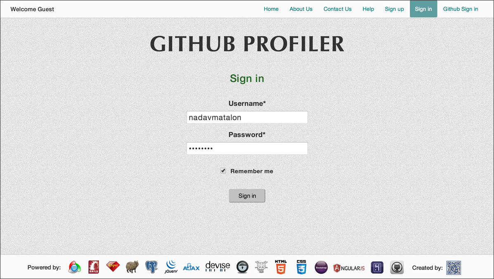
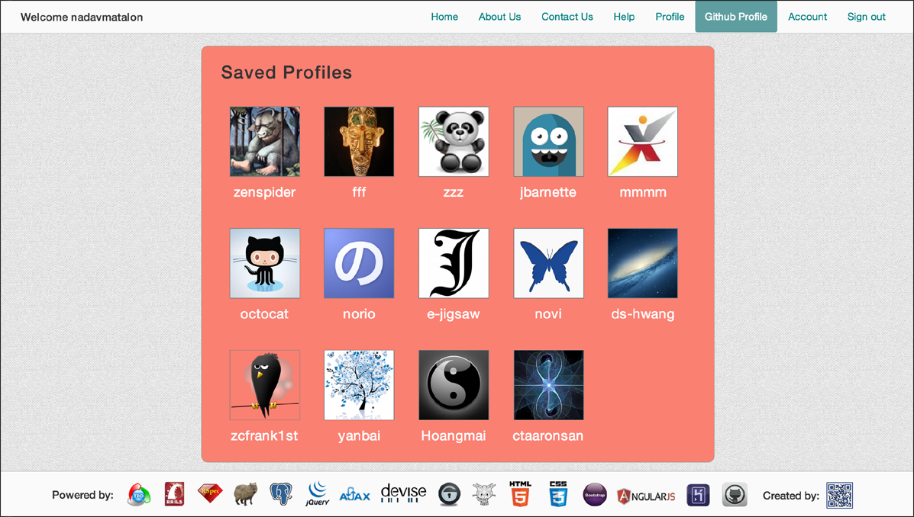

#GITHUB PROFILER 

##Table of Contents

* [Screenshots](#screenshots)
* [General Description](#general-description)
* [See it Live on Heroku](#see-it-live-on-heroku)
* [Browsers](#browsers)
* [Testing](#testing)
* [License](#license)


##Screenshots

<table>
	<tr>
		<td align="center" width=25% >
			<a href="https://raw.githubusercontent.com/nadavmatalon/github-profiler/master/app/assets/images/app_screenshot_1.png">
				
				Sign up
			</a>
		</td>
		<td align="center" width=25% >
			<a href="https://raw.githubusercontent.com/nadavmatalon/github-profiler/master/app/assets/images/app_screenshot_2.png">
				
				Search Profiles
			</a>
		</td>
		<td align="center" width=25% >
			<a href="https://raw.githubusercontent.com/nadavmatalon/github-profiler/master/app/assets/images/app_screenshot_3.png">
				
				My Github Profile
			</a>
		</td>
		<td align="center" width=25% >
			<a href="https://raw.githubusercontent.com/nadavmatalon/github-profiler/master/app/assets/images/app_screenshot_4.png">
				
				Saved Profiles
			</a>
		</td>
	</tr>
</table>


##General Description

__Github Profiler__ is a web app for browsing and storing profiles of 
[Github](http://www.github.com) users.

The app was built with [Rails 4](http://rubyonrails.org) 
according to [TDD](http://en.wikipedia.org/wiki/Test-driven_development) 
(tests written with [Rspec](http://rspec.info) 
&amp; [Capibara](https://github.com/jnicklas/capybara)), 
and implements the following libraries/gems:

* [jQuery](http://jquery.com)
* [Angular](https://angularjs.org)
* [Omniauth2](https://github.com/intridea/omniauth)
* [Devise](https://github.com/plataformatec/devise)
* [Bootstrap](http://getbootstrap.com)
* [Octokit](https://github.com/octokit/octokit.rb)

For data storage the app uses a [PostgreSQL](http://www.postgresql.org) database.

Functionality-wise, __Github Profiler__ search engine enables all users (registered or 
unregistered) to find profiles of [Github](http://www.github.com) 
users by their username.

Each profile can then be __stored in the user's account__ for future reference (registered
__Github Profiler__ users only). 

The app will automatically load the __personal profiles__ of registered users,
including extensive information about their repos, under their profile page
(for this, users need to sign up with their [Github](http://www.github.com) 
user name).

Moreover, users can use their Github username and password __to directly sign in__ to
__Github Profiler__ thereby saving them the need to go through
the registration process.

__Update (4.9.14):__ Added an Ajax-based popup window to display 'Connecting to Github' 
message + spinner while Github Profiles are being loaded.


##See it Live on Heroku

A live version of the app can be found at:

[Github Profiler on Heroku](http://github-profiler.herokuapp.com)

As I'm using Heroku's free hosting service, the app may take a bit of time to upload<br/>
(Heroku's giros take time to wake up...), so please be patient.


##Browsers

 This app has been tested with and supports the following browsers:

* __Google Chrome__ (36.0)
* __Mozilla Firefox__ (31.0)
* __Apple Safari__ (7.0.5) (see note below)

Note: For some obscure reason I have not yet managed to figure out, __Safari__ refuses to 
show the 'connecting to github' window which pops up while the data is loaded from Github 
when clicking on the 'Github Profile' button in the navigation bar.


##  Testing

Tests were written with [Rspec](http://rspec.info) (3.0.2) &amp; 
[Capybara](https://github.com/jnicklas/capybara) (2.4.1).

The tests cover both back-end logic and front-end functionality.

To run the tests in terminal: 

```bash
$> cd github-profiler
$> rspec
```

##  License

<p>Released under the <a href="http://www.opensource.org/licenses/MIT">MIT license</a>.</p>

